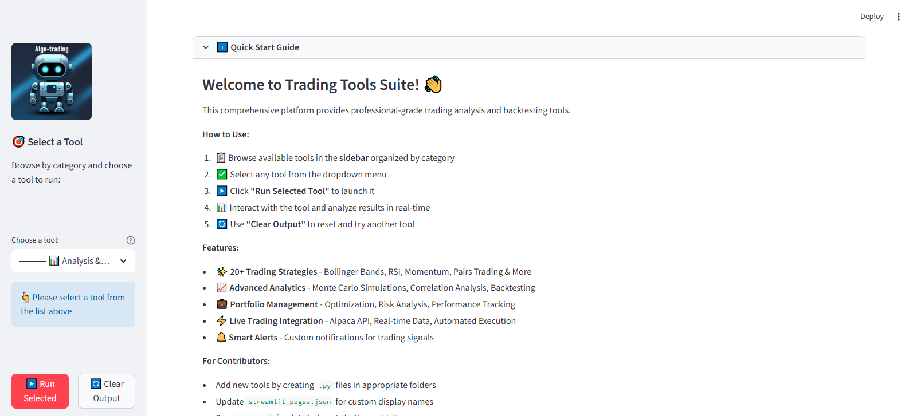
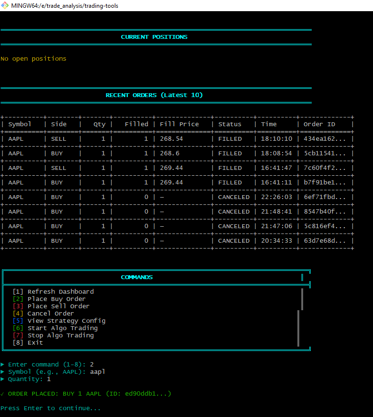
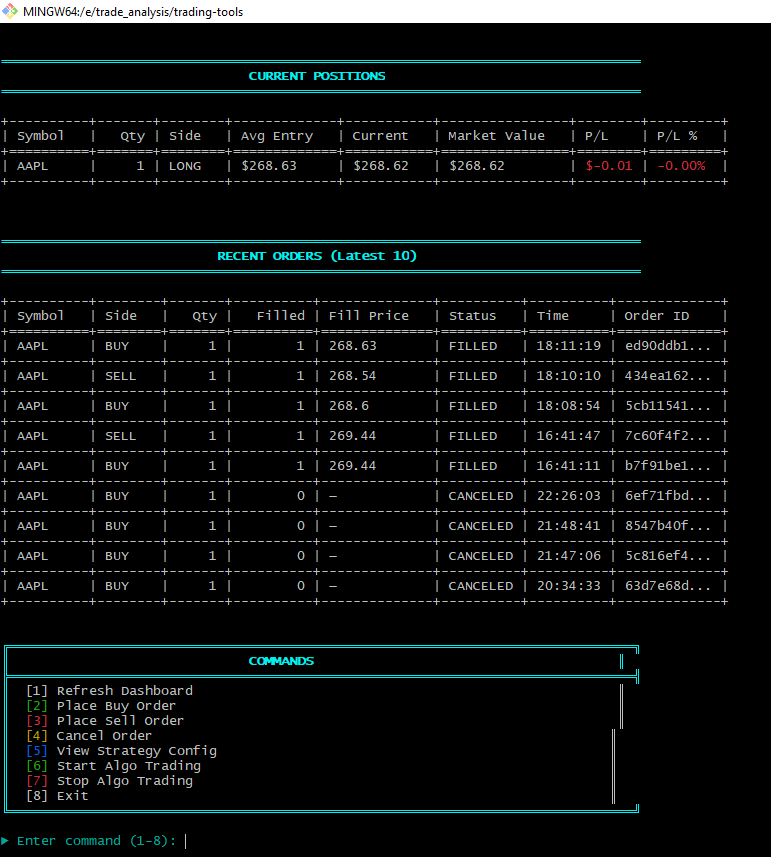
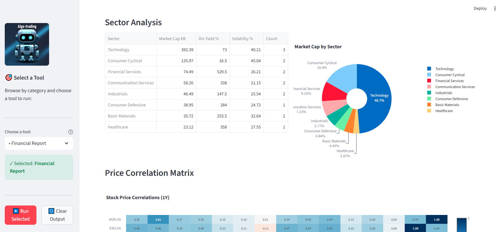
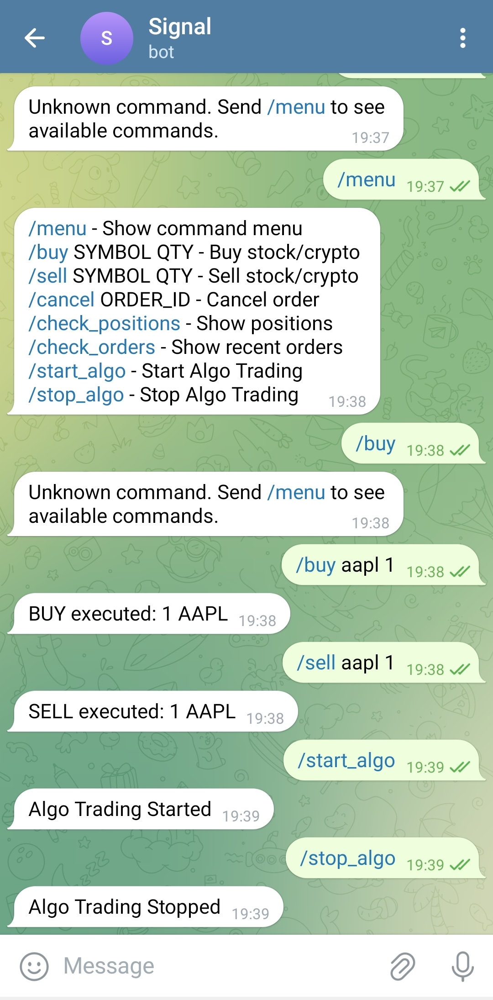

# Trading Tools

<p align="center">
    
</p>

<p align="center">
    <a href="https://trading-tools-bd3c.onrender.com" target="_blank">🔗 Live demo: trading-tools-bd3c.onrender.com</a>
</p>

> ⚠️ Note: A public demo is available on Render (link above). Please do not run heavy optimization jobs (GA/optimizers) on the live demo — these can consume large amounts of CPU and memory and may cause the app to be suspended on the free Render trial.
>
> ⚠️ Important: This app is currently configured for paper trading and testing only. It is not ready for live, real-money trading. Do not connect live trading credentials or execute real orders on the public demo or without thorough review and safety checks.

Comprehensive trading analysis platform with multiple strategies, real-time alerts, portfolio tracking, and interactive visualizations built with Streamlit.

## Features

### 📊 Core Modules
- **Multi-page Runner**: Navigate between different tools via an intuitive sidebar interface
- **Real-time Alerts**: Telegram notifications for spread trading signals
- **Portfolio Tracker**: Monitor holdings, P/L, and portfolio performance
- **Financial Reports**: Live analysis of Dutch AEX stocks with news aggregation
- **Interactive Charts**: Advanced candlestick and technical indicator visualization
- **Alpaca Integration**: Live trading dashboard with paper/live trading support

### 🎯 Trading Strategies

#### Bollinger Bands & RSI (BBRSI)
- **BBRSI Optimizer**: Genetic algorithm optimization for BB-RSI strategies
- **BBRSI Backtest**: Comprehensive backtesting with performance metrics
- **BBRSI Trailing**: Trailing stop implementation with adaptive parameters
- **Multi-stock BBRSI**: Portfolio-level BBRSI analysis across multiple securities

#### Pairs Trading & Mean Reversion
- **Pairs Trading**: Market-neutral strategies exploiting correlation divergence
- **Pair Trading Analysis**: Statistical analysis of stock pair relationships
- **PMR (Pairs Mean Reversion)**: Advanced mean reversion strategies
- **Spread Analyzer**: Real-time spread monitoring and signal generation

#### Market Making & Execution
- **Market Making**: Automated market making strategies
- **BRATR**: Bollinger-RSI Adaptive Trailing Reversion strategy

#### Momentum & Multi-Factor
- **Momentum Trading**: ROC, Stochastic, RSI, and MACD-based momentum signals
- **MIMS**: Multi-factor Intrinsic Momentum Strategy

#### Portfolio Optimization
- **Monte Carlo Simulation**: Risk assessment and portfolio optimization via simulation
- **Correlation Utilities**: Correlation analysis and indicator utilities

## Requirements

- **Python**: 3.13+
- **Key Dependencies**: 
  - Streamlit (UI framework)
  - yfinance (market data)
  - pandas, numpy (data processing)
  - plotly, matplotlib (visualization)
  - alpaca-py (trading API)
  - python-telegram-bot (alerts)
  - deap (genetic algorithms)
  - scipy, statsmodels (statistical analysis)

Install all dependencies:
```bash
pip install -r requirements.txt
```

## Quickstart

1. Clone the repository:

```bash
git clone https://github.com/Yusuprozimemet/trading-tools.git
cd trading-tools
```

2. Set up environment variables (for trading and alerts):

Create a `.env` file in the root directory:
```bash
ALPACA_ENDPOINT=https://paper-api.alpaca.markets
ALPACA_KEY=your_alpaca_key
ALPACA_SECRET=your_alpaca_secret
TELEGRAM_TOKEN=your_telegram_bot_token
TELEGRAM_CHAT_ID=your_chat_id
```

3. Run the Streamlit app:

```bash
streamlit run run.py
```

4. Select a page from the sidebar and click "Run selected" to execute it.

## Project Structure

```
trading-tools/
├── run.py                    # Multi-page Streamlit runner
├── streamlit_pages.json      # Page display name mappings
├── requirements.txt          # Python dependencies
├── .env                      # Environment variables (create this)
│
├── alert/                    # Alert System
│   ├── app.py               # Telegram alert dashboard
│   ├── alert.py             # Alert monitoring logic
│   └── config.yaml          # Alert configuration
│
├── chart/                    # Charting Module
│   └── charts.py            # Pro chart viewer with indicators
│
├── finance/                  # Financial Reports
│   └── financialReport.py   # Dutch market analysis & news
│
├── portofolio/               # Portfolio Tracking
│   └── portofolio.py        # Holdings and performance tracker
│
├── trading/                  # Live Trading
│   ├── main.py              # Trading dashboard
│   ├── alpaca_data.py       # Alpaca data visualization
│   ├── terminal_trading.py  # CLI trading interface
│   └── strategies/          # Strategy YAML configs
│       ├── bbrsi.yaml
│       ├── trend_ma.yaml
│       └── zscore_pairs.yaml
│
├── strategies/               # Strategy Modules
│   ├── BBRSI_Bollinger_RSI/
│   │   ├── bbrsi.py         # GA optimization
│   │   ├── bbrsi_backtest.py
│   │   └── BBRSIT.py        # Trailing stop variant
│   │
│   ├── Pairs_MeanReversion/
│   │   ├── pairs_trading.py
│   │   ├── pair_trading_analysis.py
│   │   ├── PMR.py
│   │   └── spread_analyzer.py
│   │
│   ├── Market_Making_Execution/
│   │   ├── marketMaking.py
│   │   └── BRATR.py
│   │
│   ├── Momentum_MultiFactor/
│   │   ├── momentumTrading.py
│   │   └── MIMS.py
│   │
│   ├── Optimization_Portfolio_Simulation/
│   │   ├── monteCarloSimulation.py
│   │   └── multiStockBBRSI.py
│   │
│   └── Correlation_Indicator_Utilities/
│       └── correlation.py
│
└── docs/                     # Documentation
    ├── bbrsi.md
    ├── pairs_trading.md
    ├── momentumTrading.md
    └── [other strategy docs]
```

## Usage Guide

### Running Different Modules

1. **Launch the app**: `streamlit run run.py`
2. **Select a page** from the sidebar dropdown (e.g., "Alerts", "Charts", "Portfolio")
3. **Click "Run selected"** to load the chosen module
4. **Configure parameters** in the sidebar of each module
5. **Click module-specific buttons** (e.g., "Generate Report", "Run Analysis") to execute

### Key Workflows

#### Setting Up Alerts
1. Navigate to "Alerts" page
2. Configure your trading pairs and spread parameters
3. Enter your Telegram bot credentials
4. Click "Start Alert System" to begin monitoring

#### Running Backtests
1. Select a strategy (e.g., "Bollinger–RSI Backtest")
2. Enter ticker symbols and date range
3. Adjust strategy parameters (BB period, RSI thresholds, etc.)
4. Click "Run Backtest" to see results

#### Live Trading (Alpaca)
1. Set up `.env` with Alpaca credentials
2. Navigate to "Trading Dashboard" or "Alpaca Data Dashboard"
3. Monitor account status and positions
4. Execute trades via the interface

#### Portfolio Analysis
1. Go to "Portfolio" page
2. Load sample data or configure your holdings
3. View performance metrics and allocation charts

## Screenshots

### Terminal Trading (CLI)
<p align="center">
    
    
</p>
*Terminal trading quick actions: place an order (left) and confirmation state (right).*

### Financial Report
<p align="center">
    
</p>

*Sample financial report output showing aggregated metrics and visualizations.*

### Mobile / Telegram Control
<p align="center">
    
</p>

*Control the app remotely via Telegram: send buy/sell commands for single stocks and start/stop algorithmic trading sessions from your phone.*

## Contributing

We welcome contributions! Here's how to add new features:

### Adding a New Strategy/Page

1. Fork the repository on GitHub: https://github.com/Yusuprozimemet/trading-tools
2. Create a feature branch: `git checkout -b feat/my-strategy`
3. Add your script to the appropriate folder:
   - Strategies → `strategies/YourCategory/your_strategy.py`
   - Tools → Create a new folder (e.g., `newtool/newtool.py`)
4. Make your script executable with Streamlit:
   ```python
   import streamlit as st
   
   st.set_page_config(page_title="Your Page Title", layout="wide")
   st.title("Your Page Title")
   
   # Your code here
   
   if __name__ == "__main__":
       # Your main logic
       pass
   ```
5. (Optional) Add a display name in `streamlit_pages.json`:
   ```json
   {
       "your_folder/your_script.py": "Friendly Display Name"
   }
   ```
6. Commit and push your branch
7. Open a Pull Request with a clear description

### Best Practices
- Use `st.cache_data` for expensive computations
- Provide clear parameter descriptions in sidebar
- Include error handling for data fetching
- Add documentation in the `docs/` folder
- Test with multiple tickers and date ranges

### Code Style
- Follow PEP 8 conventions
- Use type hints where appropriate
- Add docstrings to functions
- Keep modules focused and modular

## Deployment

### Local Deployment
```bash
streamlit run run.py --server.port 8501
```

### Docker Deployment
```bash
docker build -t trading-tools .
docker run -p 8501:8501 trading-tools
```

### Cloud Deployment (Render/Streamlit Cloud)
- The project includes `Procfile` and `render.yaml` for easy deployment
- Set environment variables in your hosting platform
- Push to GitHub and connect to your deployment service

**Public demo:** https://trading-tools-bd3c.onrender.com

> ⚠️ Reminder: the public demo is hosted on Render's free tier. Avoid running heavy optimization tasks (genetic algorithm optimizers, long Monte Carlo runs, etc.) on the demo as they may consume large CPU/memory and cause the instance to be suspended.

## Troubleshooting

### Common Issues

**"Module not found" errors**
```bash
pip install -r requirements.txt --upgrade
```

**Yahoo Finance data issues**
- Yahoo limits: 1m interval → 7 days max, hourly → 60 days max
- Try different intervals or shorter date ranges

**Alpaca connection errors**
- Verify `.env` credentials are correct
- Check if using correct endpoint (paper vs live)

**Streamlit pages not showing**
- Ensure scripts are not named `__init__.py`
- Check that scripts have proper Streamlit structure
- Verify paths in `streamlit_pages.json` match actual file paths

## License

Apache-2.0 License

## Acknowledgments

- Yahoo Finance for market data
- Alpaca Markets for trading API
- Streamlit for the amazing framework
- All contributors to this project

---

**Disclaimer**: This software is for educational and research purposes only. Trading involves substantial risk of loss. Always do your own research and never risk more than you can afford to lose.
